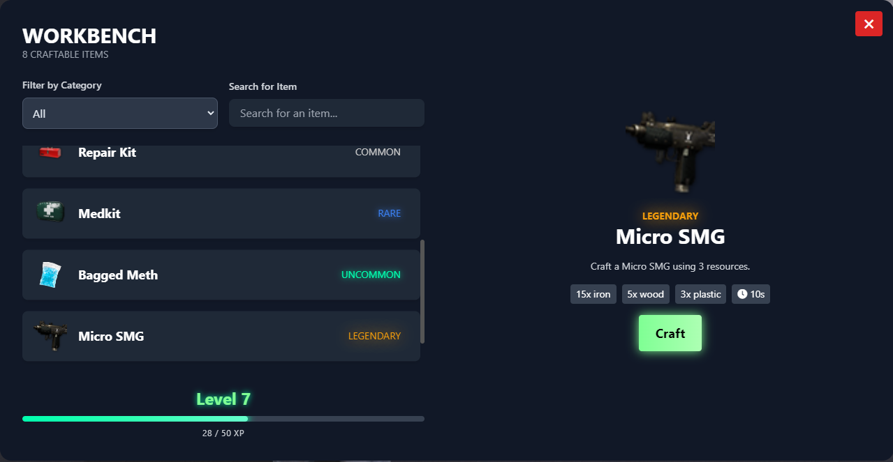

# FiveM Crafting
 

## Overview

Workbench UI is a dynamic and interactive crafting interface. This project provides a customizable and visually appealing user interface where players can craft items using various resources. It includes features such as real-time progress tracking, an experience points (XP) system, and resource categorization.

## Features

- **Crafting Queue**: Manage ongoing crafting tasks with real-time progress updates.
- **XP System**: Earn XP as you craft items, leveling up as you progress.
- **Items Categorization**: Items are grouped by resource type (e.g., weapons, healing, tools.) for easier navigation.
- **Responsive Design**: Fully responsive, ensuring the UI is optimized for different screen resolutions
- **Interactive Elements**: Smooth animations for crafting progress tasks.

## In production / Todo
- **Level Required Crafts**: Unlock more unique craft recipes based on your crafting level.
- **Notification System**: Notifications when a crafting task is completed, a new level is reached, or when new recipes become available.
